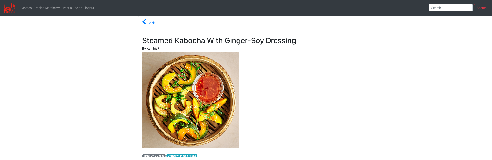

# Foodie
# Description
A social network for foodies!  Post and share recipes, and find matches for ingredients you have in your fridge.  A collaboration between @kambiz-frounchi, @adamwrites and @mbesemann.

# Table of Contents
1. [Installation](#installation)
2. [Usage](#usage)
3. [License](#license)
4. [Contributing](#contributing)
5. [Tests](#tests)
6. [Questions](#questions)
# Installation
npm i
# Usage
npm start
# License
MIT License
# Contributing
Open a pull request!